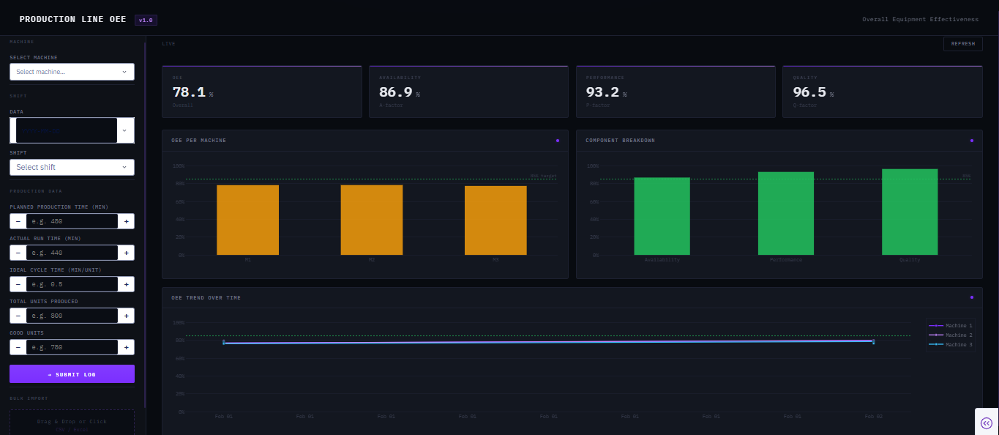

# Production Line OEE Calculator

A web-based dashboard for tracking and analyzing Overall Equipment Effectiveness (OEE) across production lines. Built with Python, Dash, Pandas, and SQLite.

---

## Preview



---

## Features

- Log production shift data manually through a web form
- Bulk import historical data via CSV or Excel file upload
- Automatically computes OEE and its three components:
  - **Availability** = Actual Run Time / Planned Production Time
  - **Performance** = (Ideal Cycle Time × Total Units) / Actual Run Time
  - **Quality** = Good Units / Total Units Produced
- Interactive charts:
  - OEE per machine (bar chart)
  - OEE trend over time per machine (line chart)
  - Average component breakdown (bar chart)
- Duplicate entry prevention via unique constraints
- Persistent SQLite database storage

---

## Tech Stack

| Tool | Purpose |
|---|---|
| Python | Core language |
| Dash | Web dashboard framework |
| Pandas | OEE computation and data manipulation |
| SQLite | Local database storage |
| Plotly | Chart rendering in Dash |
| IBM Plex Mono | Dashboard typography (via Google Fonts) |

---

## Folder Structure

```
oee-calculator/
│
├── app.py                  
├── database.py             
├── oee.py                 
├── charts.py               
├── seed.py                 
│
├── data/
│   └── oee.db             
│
├── assets/
│   └── style.css    
│
├── comp/
│   ├── __init__.py
│   ├── input_form.py    
│   └── dashboard.py    
│
└── requirements.txt
```

---

## Setup & Installation

**1. Clone the repository**
```bash
git clone https://github.com/safeu/production-line-oee.git
cd production-line-oee
```

**2. Install dependencies**
```bash
pip install -r requirements.txt
```

**3. Seed the database with sample machines**
```bash
python seed.py
```

**4. Run the app**
```bash
python app.py
```

**5. Open your browser at**
```
http://127.0.0.1:8050
```

---

## CSV Import Format

To bulk import data, upload a CSV file with the following columns:

```
machine_id, shift_date, shift, planned_production_time, actual_run_time, ideal_cycle_time, total_units_produced, good_units
```

- `shift_date` format: `YYYY-MM-DD`
- `shift` values: `morning`, `afternoon`, or `night`
- Time values in minutes, cycle time in minutes per unit

---

## Notes

- The `data/oee.db` file is auto-generated on first run
- Re-running `seed.py` on an existing database will skip duplicate machine entries
- Deleting `data/oee.db` resets all data

---

